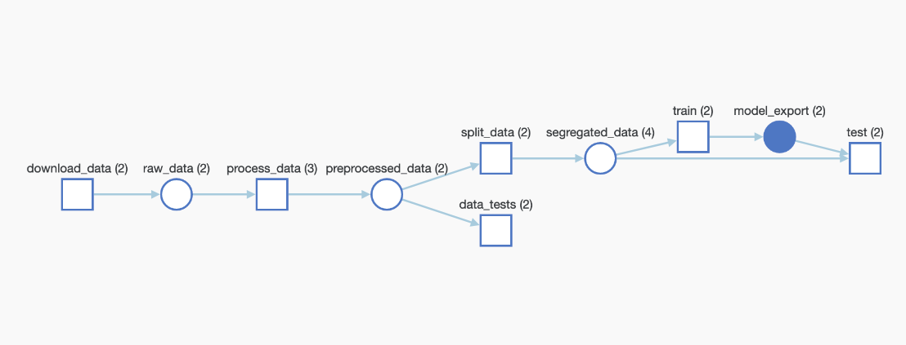

# genre_classification
Final exercise of the Udacity class on Machine learning workflows

## Exercise Description

The dataset used in this exercise is a modified version of the original
songs dataset: [here](https://www.kaggle.com/mrmorj/dataset-of-songs-in-spotify). 

The purpose of the exercise is to build a pipeline for learning the genre of the songs using a random
forest classifier. The objective is to make the pipeline reproducible. 
For that purpose we use: 
  - Weights & Biases for:
     - experiment tracking
     - artifact tracking
     - model repository
  - MLflow and Hydra for orchestration.

## Code organisation

The pipeline is made of six components each represented by a folder:
  - download: download and log the data 
  - preprocess
  - check_data: Regroup tests on our data. This is done using Pytest. We use both determinist tests and a non deterministic test (Kolmogorov Smirnov)
  - segregate: split data in train/test
  - random_forest: Fit the random forest. The choice for hyperparameters has been done independently from this pipeline.
  - evaluate

The pipeline as represented by W&B after running the code is as follow:

   


## Requirements
packages requirements:

  - mlflow~=1.23.1
  - hydra~=2.5
  - omegaconf~=2.1.1
  - wandb~=0.12.9

Environments with the relevant packages are created by mlflow for each component of the pipeline and for the 
pipeline itself.

## Running Files
The workflow is run by using the following command:
```bash
mlflow run . -P hydra_options="main.project_name=<project_name>"
```
where <project_name> is the name given to the project and under which the experiment will be saved in Weight & Biases.

## Running Remotely
To run the pipeline remotely:
```bash
mlflow run https://github.com/Geodego/genre_classification.git \
-v v1.0.0 \
-P hydra_options="main.project_name=<project_name>"
```